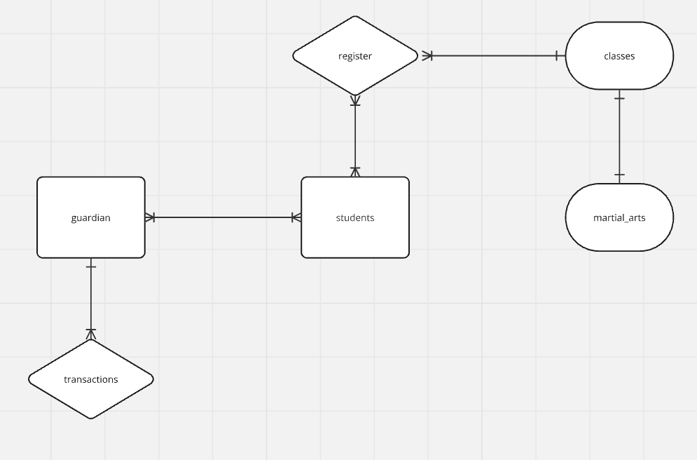

# Design Document

By Imran Shaikh

## Scope

* Which people, places, things, etc. are you including in the scope of your database?

The scope of my database includes tables:
1. students - Holds data on newly enrolled students and existing students information.
2. guardian - Holds data on the student's guardians and their contact information.
3. martial arts - Holds data on the different martial arts taught at the dojo.
4. classes - Holds data on classes, times, prices, instructors at the dojo.
5. register - Holds data on class attendance.
6. transactions - Holds data on all transactions taking place in the dojo.

* Which people, places, things, etc. are *outside* the scope of your database?

Outside the scope are data such as:
1. Additional Staff information.
2. Equipment Information.
3. External or internal competitions.
4. Student belt progression.

## Functional Requirements

* What should a user be able to do with your database?

1. View, manage and change, student and guardian information using the CRUD methods.
2. List all martial arts disciplines at the dojo and using CRUD methods, update the martial arts taught; as the dojo expands.
3. Tracking classes that are attended.
4. Monitoring the transactions information and updating the table by continuing to take payments.
5. View entity relationships between the tables using primary and foreign keys.

* What's beyond the scope of what a user should be able to do with your database?

1. Security and user authentication.
2. Belt progression tracking.
3. Tracking equipment and inventory.

## Representation

### Entities

Which entities will you choose to represent in your database and what attributes will those entities have?

1. martial_arts
* `id` `INT` `PRIMARY KEY`,
* `name` `TEXT`,

2. guardian
* `id` `INT` `PRIMARY KEY`,
* `name` `TEXT`,
* `phone` `INT`,
* `email` `TEXT`,
* `address` `TEXT`,
* `relationship` `TEXT`,

3. transactions
* `id` `INT` `PRIMARY KEY`,
* `date` `TEXT`,
* `amount` `INT`,
* `payment_method` `TEXT`,
* `guardian_id` `INT` `FOREIGN KEY`,

4. students
* `id` `INT` `PRIMARY KEY`,
* `name TEXT`,
* `dob TEXT`,
* `guardian_id` `INT` `FOREIGN KEY`,
* `join_date` `TEXT`,

5. register
* `id` `INT` `PRIMARY KEY`,
* `student_id` `INT` `FOREIGN KEY`,
* `class_id` `INT` `FOREIGN KEY`,
* `attendance_date` `TEXT`,
* `attendance_status` `TEXT`,

6. classes
* `id` `INT` `PRIMARY KEY`,
* `martial_arts_id` `INT` `FOREIGN KEY`,
* `day` `TEXT`,
* `time` `TEXT`,
* `instructor` `TEXT`,
* `price(£)` `INT`,

Why did you choose the types you did?

1. I chose `INT` for columns such as id, phone, price as these columns should have exclusively numeric values.
2. I chose `TEXT` for columns such as names, e-mail, martial arts, instructors, etc. As these columns either have alphabetic values or a mix of alphabetic and numeric values.

Why did you choose the constraints you did?

1. `Primary Key` Constraint helps to stop duplicate data by making records in a table unique, in the tables all id columns are unique.
2. `Foreign Key` Constraint links similar data between tables together to ensure integrity between tables.

### Relationships

As detailed by the diagram the relationships are:

1. Many-to-many relationship

* students-to-guardian
* students-to-register

2. One-to-many relationship

* classes-to-register
* guardian-to-transactions

3. One-to-One relationship

* classes-to-martial_arts

## Optimizations

* Which optimizations (e.g., indexes, views) did you create? Why?

I used views to save commonly queries used by the dojo, I created 3 views to optimize my data;

1. class_timetable_info - A view containing all classes info. Along side the martial arts info, to create a classes timetable that can be shared with guardians and students.
2. contact_info - A view containing student info as well as guardian info to create a table containing all necessary information to access quickly to contact a guardian or in case of an emergency.
3. students_martial_arts_info - A view containing student names and the martial arts they do to assist the dojo in making future business decisions.

## Limitations

In this section you should answer the following questions:

* What are the limitations of your design?

There is a lack of triggers, therefore data must be manually entered into each table, which can be time consuming and prone to human error. Adding triggers will make the design more dynamic.

* What might your database not be able to represent very well?

The current database does not support a progression system for grading students such as belt rankings. Another table containing the students id, belt colour and date achieved would better enhance the database.
